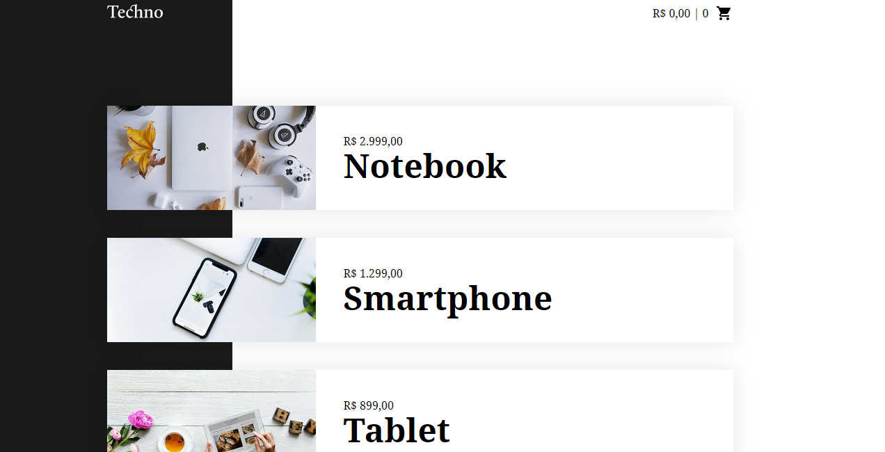
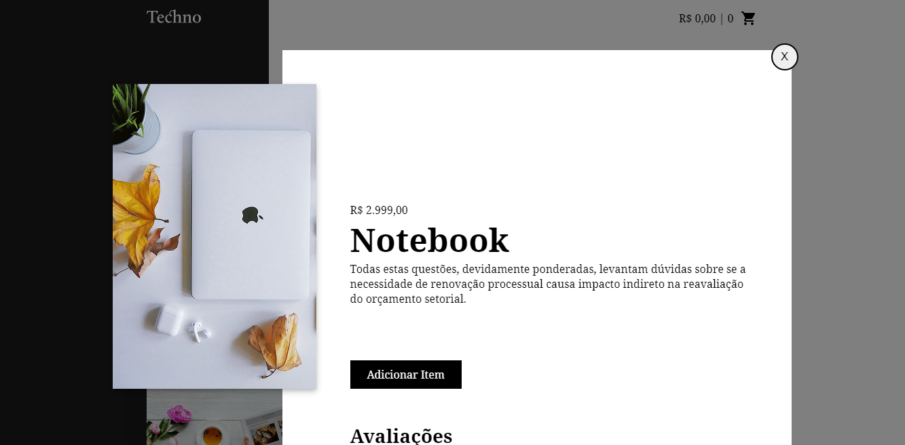

<kbd>

</kbd>
 
<h1>Techno Vue JS</h1>

SPA - Single page application

<kbd>

</kbd>

Antes de começar você precisará ter instalado em sua máquina o seguite:

<ul>
    <a href="https://git-scm.com">Git: https://git-scm.com</a>
     
    <a href="https://marketplace.visualstudio.com/items?itemName=ritwickdey.LiveServer">Live server (Visual Studio Code) https://marketplace.visualstudio.com/items?itemName=ritwickdey.LiveServer</a>    
     
</ul>

Você também precisará de um editor de texto como o VSCode o Live Server acima é pra ele.

### Rodando o Site

<ul>
    <li>Entre na pasta do projeto e abra terminal/cmd.</li>
    <li>Digite "code ." sem aspas.</li>
    <li>Ao iniciar o VSCode execute o Live Server.</li>
</ul>

### Tecnologias

As seguintes ferramentas foram usadas na construção do projeto:

<ul>
    <li>Html</li>
    <li>CSS</li>
    <li>Vue JS</li>
</ul>

### Autor

<a href="">
 
  
 <b>Carlos Eduardo</b></a>

Feito com ❤️ por Carlos Eduardo

<a href="mailto:carloseduardodiasbatista@gmail.com">Entre em contato</a>

